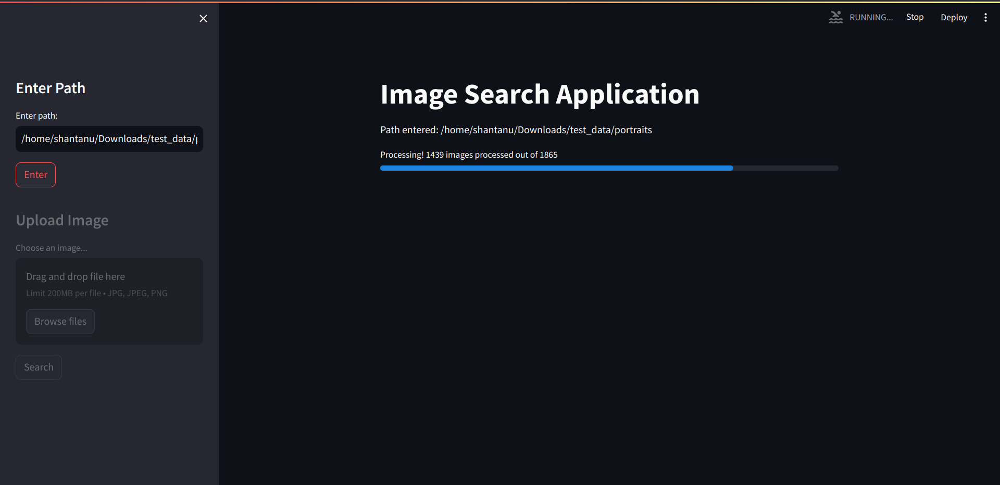
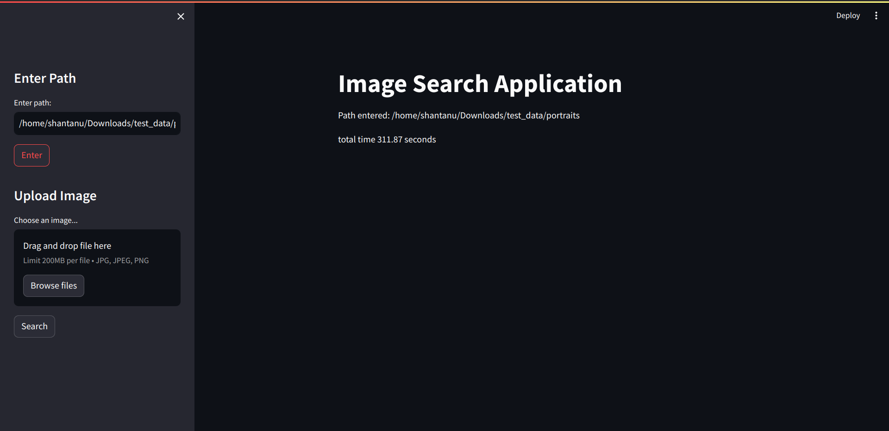
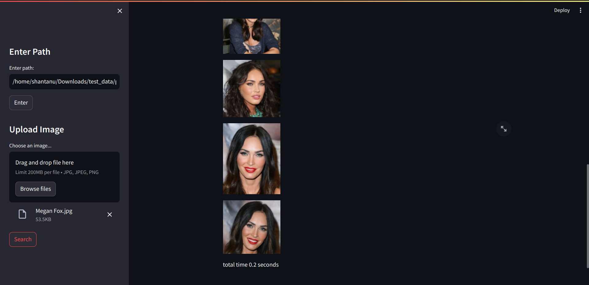

---

# Project Name
POC for retrieving similar images from Vector DB.

## Table of Contents

- [Installation](#installation)
- [Usage](#usage)


## Installation

1. Clone the repository:
   ```bash
   git clone https://github.com/Shan0199/embedding_clustering.git
   cd embedding_clustering
   ```

2. Install the required packages:
   ```bash
   pip install -r requirements.txt
   ```

## Usage

1. Run the Streamlit app:
   ```bash
   streamlit run app.py
   ```

2. Open your web browser and go to the URL provided by Streamlit to view the application.
3. Enter absolute path of the directory to populate the Vector Database

After the process is completed


4. Upload a new image and click on search to retrieve from Vector DB
